# 🔴 AI RED TEAM vs 🔵 BLUE TEAM — Аналитический Доклад 2026

<div align="center">


**[ Русский](#-русский) · [ English](#-english) · [ Deutsch](#-deutsch)**

</div>

---

##  Русский

### О проекте

Комплексный аналитический доклад о состоянии ИИ-систем в наступательной (Red Team) и защитной (Blue Team) кибербезопасности на 2026 год. Доклад включает сравнение моделей, анализ уязвимостей, матрицу доверия и прогноз до 2030 года.

### Структура репозитория

```
ai-redteam-blueteam-2026/
├── notebooks/
│   └── AI_RedTeam_BlueTeam_2026.ipynb   # Основной Jupyter Notebook
├── figures/                              # Все сгенерированные графики (11 шт.)
│   ├── 01_kpi_dashboard.png
│   ├── 02_model_comparison_bars.png
│   ├── 03_radar_capabilities.png
│   ├── 04_attack_success_rate.png
│   ├── 05_attack_defense_distribution.png
│   ├── 06_vulnerability_heatmap.png
│   ├── 07_trust_matrix.png
│   ├── 08_market_and_evolution.png
│   ├── 09_defense_effectiveness.png
│   ├── 10_roadmap_2026_2030.png
│   └── 11_winners_losers.png
├── docs/
│   └── FULL_REPORT.md                   # Полный текстовый доклад
├── requirements.txt
└── README.md
```

### Что внутри Notebook

| Раздел | Описание | Тип |
|--------|----------|-----|
| 01 | KPI Dashboard — ключевые показатели рынка | 6-panel карточки |
| 02 | Сравнение 6 флагманских моделей | Таблица + Bar charts |
| 03 | Radar chart — возможности в кибербезопасности | Spider plot |
| 04 | Attack Success Rate по типам атак и моделям | Grouped bars |
| 05 | Распределение атак и защиты | Donut charts |
| 06 | Тепловая карта уязвимостей | Heatmap |
| 07 | Матрица доверия ИИ-инфраструктуре | Horizontal bars |
| 08 | Рост рынка + эволюция моделей 2023–2026 | Line charts |
| 09 | Эффективность инструментов защиты | Bar chart |
| 10 | Roadmap 2026–2030 | Timeline |
| 11 | Победители и проигравшие к 2030 | Dual bar chart |

### Ключевые выводы

- **Red Team ИИ — FASTER:** ARTEMIS обгоняет 50% junior pentesters; Grok 2 без safeguards: 85.6% success rate
- **Blue Team ИИ — SMARTER:** MTTR ↓65%, false positive ↓40%; Nova Pro: 46.2% refusal rate (лучший щит)
- **Паритет 2026:** Исход определяет scaffolding, human oversight, контекст деплоя
- **Золотое правило:** ИИ — усилитель команды, не замена. Human-in-the-Loop обязателен

### Лучшие модели по ролям

| Роль | Модель | Почему |
|------|--------|--------|
| Pentest | Claude Sonnet 4.6 | Best long-context + code для pentest workflows |
| Defense | Amazon Nova Pro | 46.2% refusal rate — лидер в agentic среде |
| Analysis | Gemini 3.1 Pro | 94.3% GPQA, 1M context, 13/16 benchmarks |

### Установка и запуск

```bash
git clone https://github.com/atom1315/ai-vs-ai-security-2026
cd ai-redteam-blueteam-2026
pip install -r requirements.txt
jupyter notebook notebooks/AI_RedTeam_BlueTeam_2026.ipynb
```

---

##  English

### About

A comprehensive analytical report on the state of AI systems in offensive (Red Team) and defensive (Blue Team) cybersecurity for 2026. Includes model comparison, vulnerability analysis, trust matrix, and forecast to 2030.

### Key Findings

- **$52.6B** AI Security market by 2030 at +46.3% CAGR
- **No single winner** in AI vs AI: outcome depends on scaffolding, deployment context, and human oversight
- **Nova Pro** has the highest refusal rate (46.2%) in agentic environments — best defensive shield
- **ARTEMIS** (AI pentest agent) outperforms 50% of human pentesters in real competitions
- **Grok 2 in CrewAI** (no safeguards): 85.6% attack success rate — most dangerous configuration
- **Claude Sonnet 4.6** is the best single model for pentest-adjacent work (Penligent, Mar 2026)
- **Gemini 3.1 Pro** leads 13/16 major benchmarks — best for Threat Intelligence synthesis
- **Human-in-the-Loop is mandatory**, not optional — unmonitored ART vs ABT creates escalatory spirals

### Model Comparison Summary

| Model | SWE-bench | GPQA | Refusal% | Pentest Score |
|-------|-----------|------|----------|---------------|
| Claude Opus 4.6 | 74%+ | 91.3% | 38.5% | 96/100 |
| GPT-5.4 | 74.9% | 92.8% | 42.3% | 94/100 |
| Gemini 3.1 Pro | **80.6%** | **94.3%** | 42.3% | 91/100 |
| Grok 4 | 75% | ~90% | 38.5% | 82/100 |
| DeepSeek V4 | ~70% | — | 25% | 71/100 |
| Amazon Nova Pro | — | — | **46.2%** | 88/100 |

### Trust Matrix Summary

| Task | Trust Level | Risk |
|------|-------------|------|
| Log Analysis (autonomous) | 92% | LOW |
| CVE Prioritization | 88% | LOW |
| Code Security Review | 85% | LOW |
| Incident Triage (supervised) | 78% | MEDIUM |
| Full SOAR Automation | 58% | CAUTION |
| Network Reconfiguration | 35% | HIGH |
| Autonomous Pentest in PROD | 22% | CRITICAL |
| ART vs ABT unsupervised | 15% | FORBIDDEN |

### Roadmap 2026–2030

| Year | Stage | Key Change |
|------|-------|-----------|
| 2026 | AI-Assisted Pentest | Claude/GPT as copilot; ARTEMIS > 50% juniors |
| 2027 | Specialized Security LLMs | PentestGPT V3; CTEM standard |
| 2028 | Semi-Autonomous Red Teams | AI leads 80%; quantum-safe crypto mandatory |
| 2030 | Autonomous Cyber Defense | Multi-agent SOC; RSA/ECC under quantum threat |

### Installation

```bash
git clone https://github.com/atom1315/ai-vs-ai-security-2026
cd ai-redteam-blueteam-2026
pip install -r requirements.txt
jupyter notebook notebooks/AI_RedTeam_BlueTeam_2026.ipynb
```

---

##  Deutsch

### Über das Projekt

Ein umfassender analytischer Bericht über den Stand der KI-Systeme in der offensiven (Red Team) und defensiven (Blue Team) Cybersicherheit für 2026. Enthält Modellvergleich, Schwachstellenanalyse, Vertrauensmatrix und Prognose bis 2030.

### Wichtigste Erkenntnisse

- **$52,6 Mrd.** KI-Sicherheitsmarkt bis 2030 mit +46,3% CAGR
- **Kein eindeutiger Gewinner** bei KI vs. KI: Das Ergebnis hängt von Scaffolding, Bereitstellungskontext und menschlicher Aufsicht ab
- **Nova Pro** hat die höchste Ablehnungsrate (46,2%) in agentenbasierten Umgebungen — bester defensiver Schutzschild
- **ARTEMIS** (KI-Pentest-Agent) übertrifft 50% der menschlichen Pentester in echten Wettbewerben
- **Grok 2 in CrewAI** (ohne Schutzmaßnahmen): 85,6% Angriffserfolgrate — gefährlichste Konfiguration
- **Human-in-the-Loop ist obligatorisch** — unbeaufsichtigtes ART vs. ABT erzeugt eskalierende Spiralen

### Modellvergleich

| Modell | SWE-bench | GPQA | Ablehnungsrate | Pentest |
|--------|-----------|------|----------------|---------|
| Claude Opus 4.6 | 74%+ | 91,3% | 38,5% | 96/100 |
| GPT-5.4 | 74,9% | 92,8% | 42,3% | 94/100 |
| Gemini 3.1 Pro | **80,6%** | **94,3%** | 42,3% | 91/100 |
| Grok 4 | 75% | ~90% | 38,5% | 82/100 |
| DeepSeek V4 | ~70% | — | 25% | 71/100 |
| Amazon Nova Pro | — | — | **46,2%** | 88/100 |

### Beste Modelle nach Rolle

| Rolle | Modell | Grund |
|-------|--------|-------|
| Pentest | Claude Sonnet 4.6 | Bester Long-Context + Code für Pentest-Workflows |
| Verteidigung | Amazon Nova Pro | 46,2% Ablehnungsrate — Marktführer in agentenbasierter Umgebung |
| Analyse | Gemini 3.1 Pro | 94,3% GPQA, 1M Kontext, Marktführer bei 13/16 Benchmarks |

### Installation

```bash
git clone https://github.com/atom1315/ai-vs-ai-security-2026
cd ai-redteam-blueteam-2026
pip install -r requirements.txt
jupyter notebook notebooks/AI_RedTeam_BlueTeam_2026.ipynb
```

---

## 📊 Графики / Figures / Abbildungen

| # | Название / Title | Превью |
|---|-----------------|--------|
| 01 | KPI Dashboard | 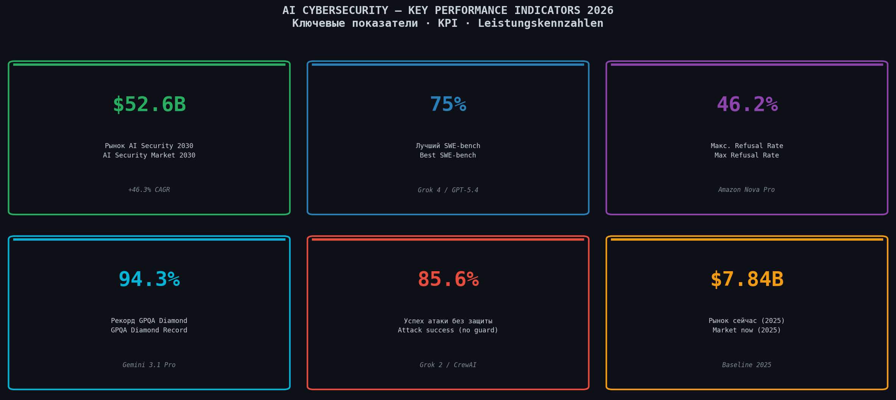 |
| 02 | Model Comparison Bars | 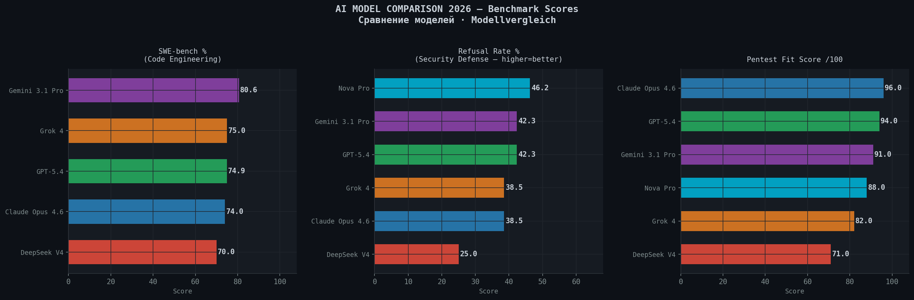 |
| 03 | Radar Capabilities | 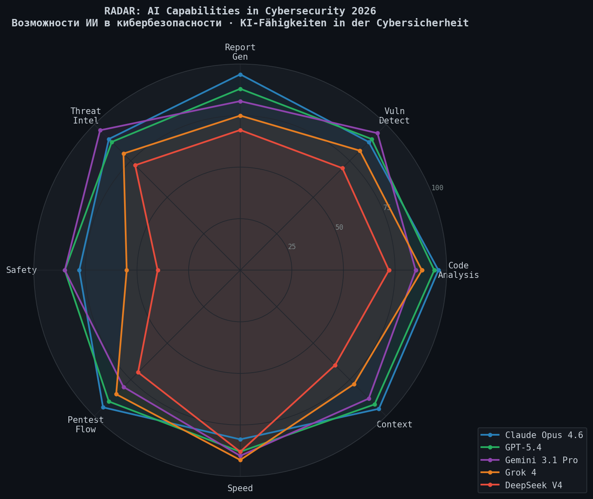 |
| 04 | Attack Success Rate | 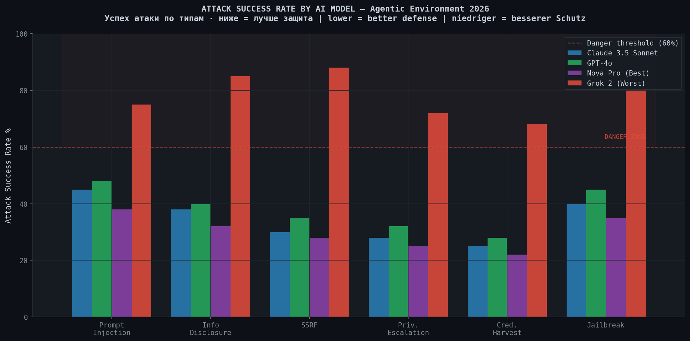 |
| 05 | Attack/Defense Distribution | 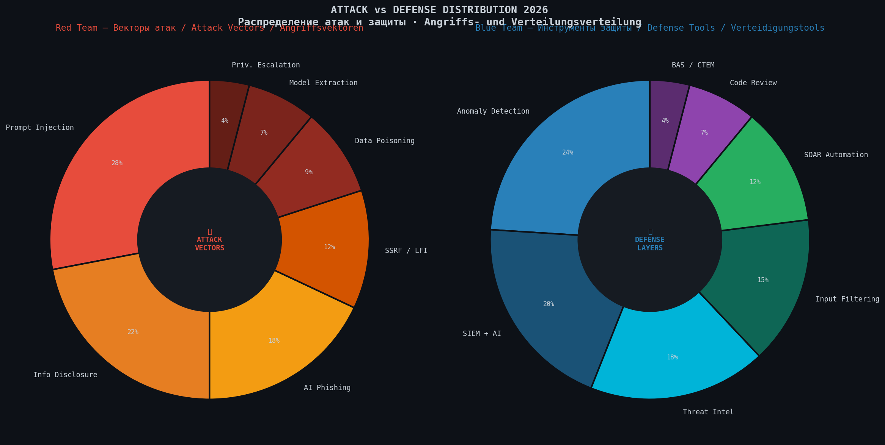 |
| 06 | Vulnerability Heatmap | 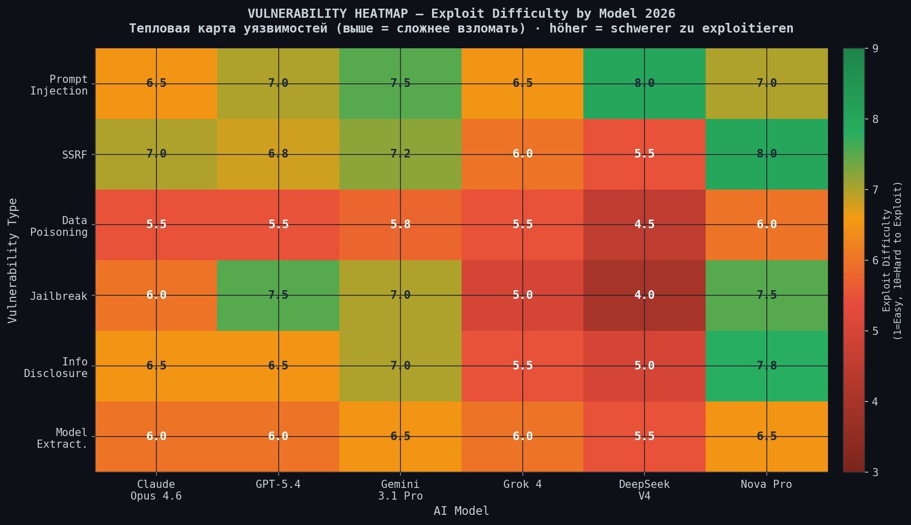 |
| 07 | Trust Matrix | 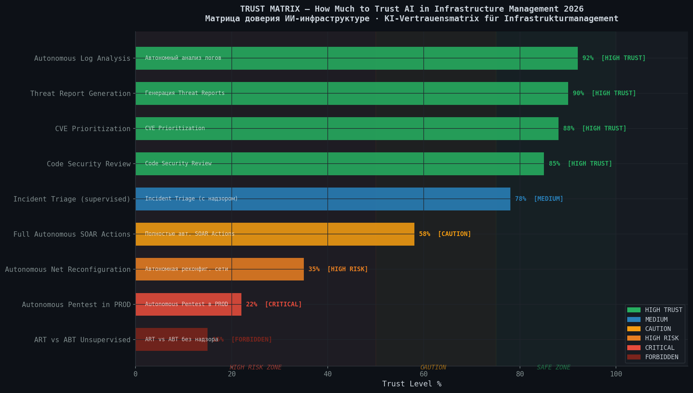 |
| 08 | Market Growth & Evolution | 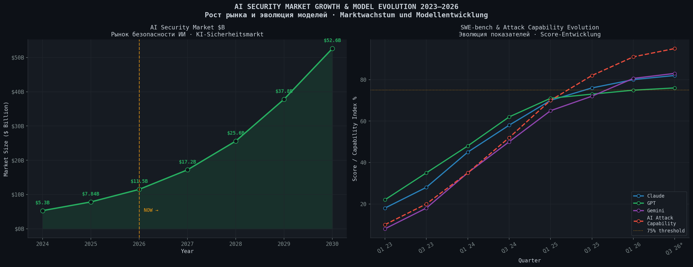 |
| 09 | Defense Effectiveness | 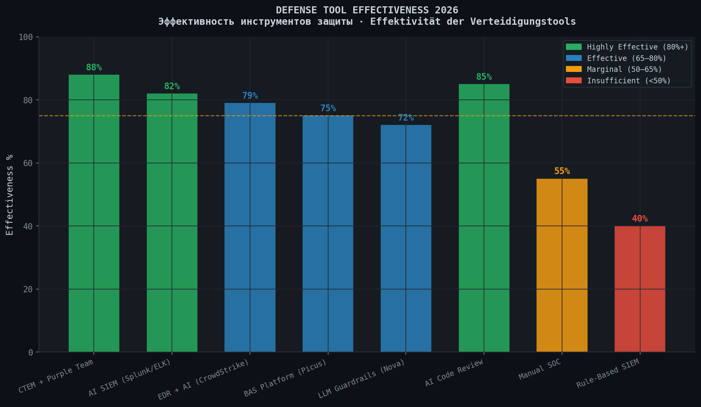 |
| 10 | Roadmap 2026–2030 | 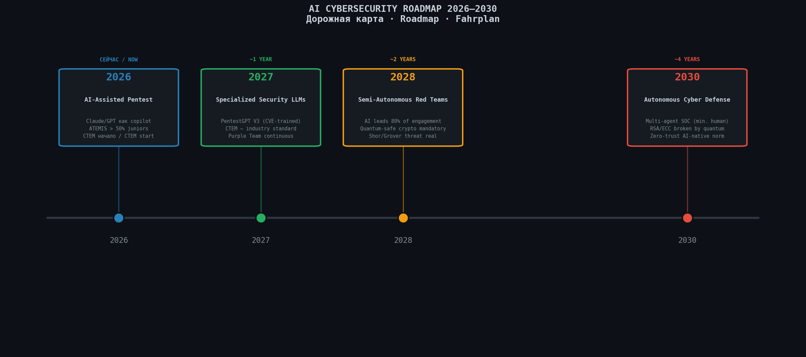 |
| 11 | Winners & Losers | 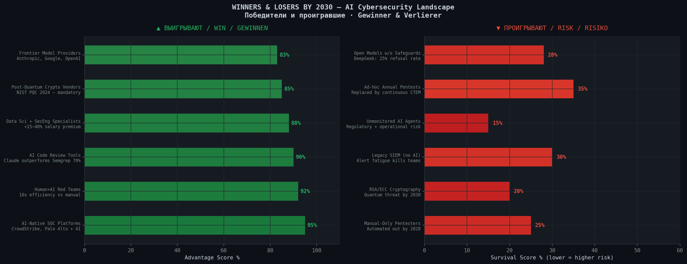 |

---

## 📚 Источники / Sources / Quellen

1. arXiv 2512.14860 — *Penetration Testing of Agentic AI: A Comparative Security Analysis* (Dec 2025)
2. arXiv 2501.06963 — *GenAI-Supported Pentesting: Claude Opus vs GPT-4 vs Copilot*
3. ISACA — *Autonomous Red vs Blue Teaming: A New Frontier in Cybersecurity* (Feb 2026)
4. Penligent AI — *Best AI Model for Pentesting 2026* (Mar 2026)
5. LM Council — *AI Model Benchmarks Mar 2026* (GPT-5.4, Claude 4.6, Gemini 3.1, Grok 4)
6. Mindgard Research — *Bypassing Prompt Injection and Jailbreak Detection* (2025)
7. CyberScoop — *Red and Blue Teams in the 2026 Threat Landscape*
8. USENIX Security 2024 — *PentestGPT: Evaluating LLMs for Automated Penetration Testing*

---

## ⚖️ Лицензия / License / Lizenz

MIT License — свободное использование с указанием источника / free use with attribution / freie Nutzung mit Quellenangabe

---


